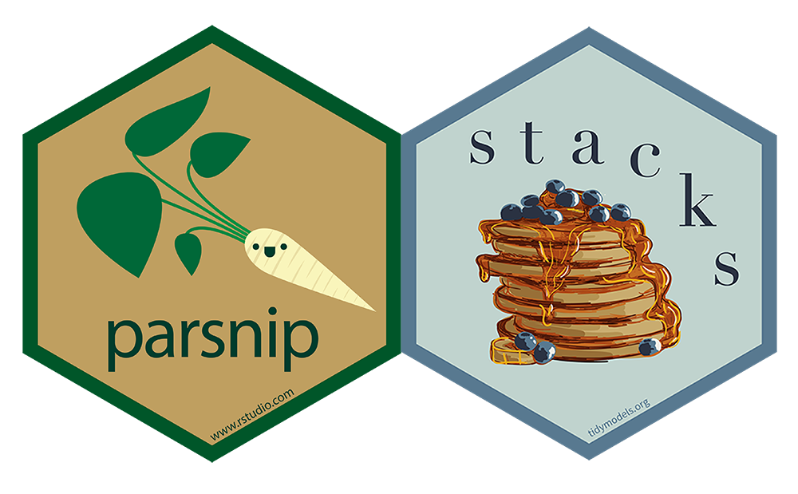

## Marketing Analytics Process

<center>
{width=900px}
</center>

## Predictive Modeling Workflow

<center>
{width=900px}
</center>

---

{width=850px}

## Simplicity vs. Complexity

So far we have covered two *distinct* predictive models for *supervised learning*.

- *Decision trees*, which are simple and interpretable.
- *Neural networks*, which are complex and very much black boxes.

When is a simple model enough? When is a complex model needed? Why not try to combine the benefits of both types of models?

## Preliminaries

Install the `xgboost` and `stacks` packages.

## Preamble

Load packages and functions first.

```{r message=FALSE, warning=FALSE}
# Load packages and functions.
library(tidyverse)
library(tidymodels)
library(stacks)

fit_accuracy <- function(fit, testing_data, truth) {
  fit |> 
    predict(new_data = testing_data) |>
    bind_cols(testing_data) |>
    accuracy(truth = {{truth}}, estimate = .pred_class)
}

# Set a seed.
set.seed(420)
```

## Data Wrangling

```{r message=FALSE, warning=FALSE}
# Import data, wrangle S1 into segment, coerce factors, and select predictors.
roomba_survey <- read_csv(here::here("Data", "roomba_survey.csv")) |> 
  rename(segment = S1) |> 
  mutate(
    segment = case_when(
      segment == 1 ~ "own",
      segment == 3 ~ "shopping",
      segment == 4 ~ "considering"
    ),
    segment = factor(segment),
    D2HomeType = factor(D2HomeType),
    D3Neighborhood = factor(D3Neighborhood),
    D4MaritalStatus = factor(D4MaritalStatus),
    D6Education = factor(D6Education)
  ) |> 
  select(
    segment, contains("RelatedBehaviors"), contains("ShoppingAttitudes"), 
    D1Gender, D2HomeType, D3Neighborhood, D4MaritalStatus, D6Education
  )
```

## Feature Engineering

Split the data and specify a recipe.

```{r}
# Split data based on segment.
roomba_split <- initial_split(roomba_survey, prop = 0.75, strata = segment)

# Use v-fold cross-validation based on segment.
roomba_cv <- vfold_cv(training(roomba_split), v = 10, strata = segment)

# Feature engineering.
roomba_recipe <- training(roomba_split) |>
  recipe(
    segment ~ .
  ) |>
  step_dummy(all_nominal_predictors()) |> 
  step_zv(all_predictors()) |>
  step_normalize(all_predictors())
```

## Decision Trees

Hop right into parameter tuning.

```{r}
# Decision tree.
roomba_dt <- decision_tree(tree_depth = tune(), min_n = tune()) |> 
  set_engine(engine = "rpart") |> 
  set_mode("classification")

# Workflow.
roomba_wf_dt <- workflow() |> 
  add_recipe(roomba_recipe) |> 
  add_model(roomba_dt)
```

---

We need to specify the `control` argument for `tune_grid()` to organize resamples to use with stacking later:

- `control_stack_grid()` for `tune_grid()`.
- `control_stack_resamples()` for `fit_resamples()`.

These arguments ensure that cross-validation will work with a stacked model type (results are shared throughout the stack).

```{r}
# Hyperparameter tuning.
tune_dt <- roomba_wf_dt |> 
  tune_grid(
    resamples = roomba_cv,
    control = control_stack_grid(),
    grid = 10
  )
```

---

Let's finalize the workflow and compute predictive fit. What are some of the possible issues with a single decision tree?

```{r}
# Finalized workflow.
fit_dt <- roomba_wf_dt |> 
  finalize_workflow(select_best(tune_dt, metric = "accuracy")) |> 
  fit(data = training(roomba_split))

fit_accuracy(fit_dt, testing(roomba_split), segment)
```

## Wisdom of the Crowd

For decision trees, and other predictive models, there is often a benefit to combining the predictions of many models into an **ensemble**. Intuitively, this benefit is the "wisdom of the crowd" -- where many average people can outperform a single expert. We'll cover three essential ensembling approaches:

- **Bagging** consists of resampling the training data, fitting separate decision trees on each resample, and averaging the predictions.
- **Boosting** builds decision trees sequentially where each subsequent decision tree uses information from the previous decision trees in the sequence, and aggregating the predictions.
- **Stacking** is a more general ensembling procedure that allows us to combine the predictions of different types of models (not just decision trees) - or even different configurations of a single model.

## Bagging

Bagging is short for **bootstrap aggregation**.

- A bootstrap is simply a resampling procedure that resamples *with replacement*.
- Each training data resample has the same number of observations, but observations may repeat in a given resample.

As we've seen, fitting decision trees on resamples of the training data helps us avoid learning anything weird in the training data. If we also choose a *random* subset of predictors for each decision tree, we get a *random forest*.

## Random Forests

Random forests use *bagging* plus random sampling of predictors to *decorrelate the decision trees*, which is an improvement over bagging decision trees only. Why does decorrelating the decision trees help?

```{r}
# Random forest.
roomba_rf <- rand_forest(mtry = tune(), trees = tune(), min_n = tune()) |> 
  set_engine(engine = "randomForest") |>
  set_mode("classification")

# Workflow. Update the decision tree workflow to use a RF model
roomba_wf_rf <- roomba_wf_dt |> 
  update_model(roomba_rf)
```

---

```{r message=FALSE, warning=FALSE}
# Hyperparameter tuning.
tune_rf <- roomba_wf_rf |> 
  tune_grid(
    resamples = roomba_cv,
    control = control_stack_grid()
  )

# Finalized workflow.
fit_rf <- roomba_wf_rf |> 
  finalize_workflow(select_best(tune_rf, metric = "accuracy")) |> 
  fit(data = training(roomba_split))

fit_accuracy(fit_rf, testing(roomba_split), segment)
```

## Boosting

Because boosting builds decision trees sequentially, they can't be parallelized and thus are slow to train in comparison to bagging or random forests.

- The first decision tree is fit normally.
- The second decision tree is fit with the *residuals* from the first model as the outcome.
- Subsequent decision trees are similarly fit on a modified version of the original training data based on the performance of the previous trees.

## Boosted Trees

The {xgboost} package uses *eXtreme Gradient Boosting* to fit boosted decision trees. The hyperparameters look like a combination of decision trees and random forests plus:

- `learn_rate` specifies the rate at which the boosting adapts across iterations.
- `sample_size` the proportion of data that is used to train at each iteration.

```{r}
# Boosted tree.
roomba_bt <- boost_tree(
  tree_depth = tune(), trees = tune(), learn_rate = tune(), 
  mtry = tune(), min_n = tune(), sample_size = tune()
) |>
  set_engine("xgboost") |> 
  set_mode("classification")
```

---

```{r message=FALSE, warning=FALSE}
# Workflow.
roomba_wf_bt <- roomba_wf_dt |> 
  update_model(roomba_bt)

# Hyperparameter tuning.
tune_bt <- roomba_wf_bt |> 
  tune_grid(
    resamples = roomba_cv,
    control = control_stack_grid()
  )
```

---

```{r}
# Finalized workflow.
fit_bt <- roomba_wf_bt |> 
  finalize_workflow(select_best(tune_bt, metric = "accuracy")) |>
  fit(data = training(roomba_split))

fit_accuracy(fit_bt, testing(roomba_split), segment)
```

## Stacking

While bagging and boosting applies *only* to decision trees, stacking allows us to combine the predictions of many different models and model configurations.

- Each model in a stack is a **candidate**.
- A model called a **meta-learner** is fit over the candidate models with their predictions *as* predictors.
- Candidates with non-zero weights from the meta-learner become ensemble members.

Stacking has the potential to bring together the benefits of simple and complex models.

## Neural Networks

Let's fit a neural network that will be included in our **model stack**.

```{r}
# Neural network.
roomba_nn <- mlp(hidden_units = tune(), epochs = tune(), penalty = tune()) |> 
  set_engine(engine = "nnet") |> 
  set_mode("classification")

# Workflow.
roomba_wf_nn <- roomba_wf_dt |> 
  update_model(roomba_nn)
```

---

```{r}
# Hyperparameter tuning.
tune_nn <- roomba_wf_nn |> 
  tune_grid(
    resamples = roomba_cv,
    control = control_stack_grid()
  )

# Finalized workflow.
fit_nn <- roomba_wf_nn |> 
  finalize_workflow(select_best(tune_nn, metric = "accuracy")) |> 
  fit(data = training(roomba_split))

fit_accuracy(fit_nn, testing(roomba_split), segment)
```

## Specify a Model Stack

A model stack functions a lot like a workflow. Note that every candidate has to be fit on resamples (i.e., fit using `fit_resamples()` or `tune_grid()`).

```{r message=FALSE, warning=FALSE}
# Stack of candidate ensemble members.
roomba_stack <- stacks() |> 
  add_candidates(tune_dt) |> 
  add_candidates(tune_rf) |> 
  add_candidates(tune_bt) |>
  add_candidates(tune_nn)

roomba_stack
```

## Aggregate Predictions

The `blend_predictions()` function does just that by fitting the meta-learner and assigning weights to all of the candidates. We can then use those weights to aggregate the member predictions with `fit_members()`.

```{r message=FALSE, warning=FALSE}
# Aggregate predictions.
fit_stack <- roomba_stack |> 
  blend_predictions() |>
  fit_members()

fit_stack
```

## Custom Penalty

Setting a (smaller) custom penalty for the model stack may result in more models being used.

```{r message=FALSE, warning=FALSE}
# Aggregate predictions.
fit_stack_of <- roomba_stack |> 
  blend_predictions(penalty = 0.01) |>
  fit_members()

fit_stack_of
```

---

```{r}
# Create a table of predictive fit.
bind_cols(
  model = c("dt", "rf", "bt", "nn", "stack", "stack_of"),
  bind_rows(
    fit_accuracy(fit_dt, testing(roomba_split), segment),
    fit_accuracy(fit_rf, testing(roomba_split), segment),
    fit_accuracy(fit_bt, testing(roomba_split), segment),
    fit_accuracy(fit_nn, testing(roomba_split), segment),
    fit_accuracy(fit_stack, testing(roomba_split), segment),
    fit_accuracy(fit_stack_of, testing(roomba_split), segment)
  )
)
```

## Wrapping Up

*Summary*

- Reviewed decision trees, random forests, and neural networks.
- Introduced bagging, boosting, and stacking as ensembling methods.

*Next Time*

- Unsupervised learning.

*Supplementary Material*

- *Tidy Modeling with R* Chapter 20

## Exercise 19

One last time, return to the data from the previous three exercises.

1. Build a logistic regression, decision tree, random forest, boosted tree, and a neural network as well as a stacking ensemble with all five of the model types as candidates. Use the same random training and testing split.
2. Create a table comparing all six models. Which is the best-fitting model? Why do you think its the best-fitting model for this specific problem?
3. Render the Quarto document into Word and upload to Canvas.

